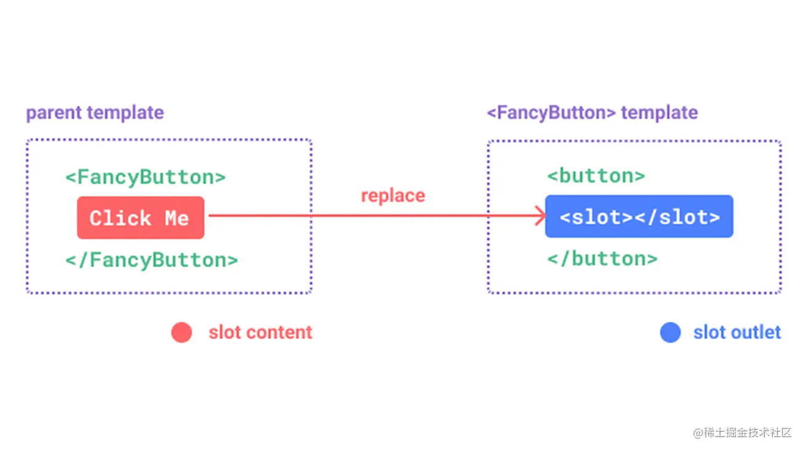

> [[保姆级] Vue3 开发文档](https://juejin.cn/post/7220220100384407610)
>
> [Vue3.2 setup语法糖、Composition API、状态库Pinia归纳总结](https://juejin.cn/post/7006108454028836895)
>
> [花了一天的时间，地板式扫盲了vue3所有API盲点](https://juejin.cn/post/7164159759619194893)
>
> [vue3+setup+ts 🔥（万字总结）](https://juejin.cn/post/7158331832512020511)

## 一、文件结构

Vue2中，`<template>` 标签中只能有一个根元素，在Vue3中没有此限制

```javascript
<template>
  // ...
</template>

<script setup>
  // ...
</script>

<style lang="scss" scoped>
  // 支持CSS变量注入v-bind(color)
</style>
```

## 二、data

```javascript
<script setup>
  import { reactive, ref, toRefs } from 'vue'

  // ref声明响应式数据，用于声明基本数据类型
  const name = ref('Jerry')
  // 修改
  name.value = 'Tom'

  // reactive声明响应式数据，用于声明引用数据类型
  const state = reactive({
    name: 'Jerry',
    sex: '男'
  })
  // 修改
  state.name = 'Tom'
  
  // 使用toRefs解构
  const {name, sex} = toRefs(state)
  // template可直接使用{{name}}、{{sex}}
</script>
```

## 三、method

```javascript
<template>
  // 调用方法
  <button @click='changeName'>按钮</button>  
</template>

<script setup>
  import { reactive } from 'vue'

  const state = reactive({
    name: 'Jery'
  })

  // 声明method方法
  const changeName = () => {
    state.name = 'Tom'
  }  
</script>
```

## 四、computed

```javascript
<script setup>
  import { computed, ref } from 'vue'

  const count = ref(1)

  // 通过computed获得doubleCount
  const doubleCount = computed(() => {
    return count.value * 2
  })
  // 获取
  console.log(doubleCount.value)
</script>
```

## 五、watch

```javascript
<script setup>
  import { watch, reactive } from 'vue'

  const state = reactive({
    count: 1
  })

  // 声明方法
  const changeCount = () => {
    state.count = state.count * 2
  }

  // 监听count
  watch(
    () => state.count,
    (newVal, oldVal) => {
      console.log(state.count)
      console.log(`watch监听变化前的数据：${oldVal}`)
      console.log(`watch监听变化后的数据：${newVal}`)
    },
    {
      immediate: true, // 立即执行
      deep: true // 深度监听
    }
  )
</script>
```

## 六、props父传子

### 子组件

```javascript
<template>
  <span>{{props.name}}</span>
  // 可省略【props.】
  <span>{{name}}</span>
</template>

<script setup>
  // import { defineProps } from 'vue'
  // defineProps在<script setup>中自动可用，无需导入
  // 需在.eslintrc.js文件中【globals】下配置【defineProps: true】

  // 声明props
  const props = defineProps({
    name: {
      type: String,
      default: ''
    }
  })  
</script>
```

### 父组件

引入子组件，组件会自动注册

```javascript
<template>
  <child name='Jerry'/>  
</template>

<script setup>
  // 引入子组件
  import child from './child.vue'
</script>
```

## 七、emit子传父

### 子组件

```javascript
<template>
  <span>{{props.name}}</span>
  // 可省略【props.】
  <span>{{name}}</span>
  <button @click='changeName'>更名</button>
</template>

<script setup>
  // import { defineEmits, defineProps } from 'vue'
  // defineEmits和defineProps在<script setup>中自动可用，无需导入
  // 需在.eslintrc.js文件中【globals】下配置【defineEmits: true】、【defineProps: true】
	
  // 声明props
  const props = defineProps({
    name: {
      type: String,
      default: ''
    }
  }) 
  // 声明事件
  const emit = defineEmits(['updateName'])
  
  const changeName = () => {
    // 执行
    emit('updateName', 'Tom')
  }
</script>
```

### 父组件

```javascript
<template>
  <child :name='state.name' @updateName='updateName'/>  
</template>

<script setup>
  import { reactive } from 'vue'
  // 引入子组件
  import child from './child.vue'

  const state = reactive({
    name: 'Jerry'
  })
  
  // 接收子组件触发的方法
  const updateName = (name) => {
    state.name = name
  }
</script>
```

## 八、v-model

支持绑定多个`v-model`，`v-model` 是 `v-model:modelValue` 的简写 
 绑定其他字段，如：`v-model:name`

### 子组件

```javascript
<template>
  <span @click="changeInfo">我叫{{ modelValue }}，今年{{ age }}岁</span>
</template>

<script setup>
  // import { defineEmits, defineProps } from 'vue'
  // defineEmits和defineProps在<script setup>中自动可用，无需导入
  // 需在.eslintrc.js文件中【globals】下配置【defineEmits: true】、【defineProps: true】

  defineProps({
    modelValue: String,
    age: Number
  })

  const emit = defineEmits(['update:modelValue', 'update:age'])
  const changeInfo = () => {
    // 触发父组件值更新
    emit('update:modelValue', 'Tom')
    emit('update:age', 30)
  }
</script>
```

### 父组件

```javascript
<template>
  // v-model:modelValue简写为v-model
  // 可绑定多个v-model
  <child
    v-model="state.name"
    v-model:age="state.age"
  />
</template>

<script setup>
  import { reactive } from 'vue'
  // 引入子组件
  import child from './child.vue'

  const state = reactive({
    name: 'Jerry',
    age: 20
  })
</script>
```

## 九、nextTick

```javascript
<script setup>
  import { nextTick } from 'vue'
	
  nextTick(() => {
    // ...
  })
</script>
```

## 十、ref子组件实例和defineExpose

- 在标准组件写法里，子组件的数据都是默认隐式暴露给父组件的，但在 script-setup 模式下，所有数据只是默认 return 给 template 使用，不会暴露到组件外，所以父组件是无法直接通过挂载 ref 变量获取子组件的数据。
- 如果要调用子组件的数据，需要先在子组件显示的暴露出来，才能够正确的拿到，这个操作，就是由 defineExpose 来完成。

### 子组件

```javascript
<template>
  <span>{{state.name}}</span>
</template>

<script setup>
  import { reactive, toRefs } from 'vue'
  // defineExpose无需引入
  // import { defineExpose, reactive, toRefs } from 'vue'

  // 声明state
  const state = reactive({
    name: 'Jerry'
  }) 
	
  // 将方法、变量暴露给父组件使用，父组件才可通过ref API拿到子组件暴露的数据
  defineExpose({
    // 解构state
    ...toRefs(state),
    // 声明方法
    changeName () {
      state.name = 'Tom'
    }
  })
</script>
```

### 父组件

#### 1. 获取一个子组件实例

```typescript
<template>
  <child ref='childRef'/>
</template>

<script setup>
  import { ref, nextTick } from 'vue'
  // 引入子组件
  import child from './child.vue'

  // 子组件ref（TypeScript语法）
  const childRef = ref<InstanceType<typeof child>>()
  
  // nextTick
  nextTick(() => {
    // 获取子组件name
    console.log(childRef.value.name)
    // 执行子组件方法
    childRef.value.changeName()
  })
</script>
```

#### 2. 获取多个子组件实例：在 v-for 中获取子组件实例

这种情况仅适用于 v-for `循环数是固定的情况` ，因为如果 v-for `循环数` 在初始化之后发生改变，那么就会导致 childRefs 再一次重复添加，childRefs 中会出现重复的子组件实例

```typescript
<template>
  <div v-for="item in 3" :key="item">
    <child :ref='addChildRef'/>
  </div>
</template>

<script setup>
  // 省略...
  
  // 子组件实例数组
  const childRefs = ref([])
  // 通过 addChildRef 方法向 childRefs 添加子组件实例
  const addChildRef = (el) => {
    childRefs.value.push(el)
  }
</script>
```

#### 3. 获取多个子组件实例：动态 v-for 获取子组件实例

通过下标来向 childRefs 添加/修改，初始化之后，动态修改 v-for 循环数，会自动根据下标重新修改该下标对应的数据

```typescript
<template>
  <button @click='childNums++'></button>
  <div v-for="(item, i) in childNums" :key="item">
    // 通过下标向 childRefs 动态添加子组件实例
    <child :ref='(el) => childRefs[i] = el'/>
  </div>
  <button @click='childNums--'></button>
</template>

<script setup>
  // 省略...
  
  // 子组件数量
  const childNums = ref(1)
  // 子组件实例数组
  const childRefs = ref([])
</script>
```

## 十、插槽slot

### 子组件

```javascript
<template>
  // 匿名插槽
  <slot/>
  // 具名插槽
  <slot name='title'/>
  // 作用域插槽
  <slot name="footer" :scope="state" />
</template>

<script setup>
  import { useSlots, reactive } from 'vue'
  const state = reactive({
    name: '张三',
    age: '25岁'
  })
  
  const slots = useSlots()
  // 匿名插槽使用情况
  const defaultSlot = reactive(slots.default && slots.default().length)
  console.log(defaultSlot) // 1
  // 具名插槽使用情况
  const titleSlot = reactive(slots.title && slots.title().length)
  console.log(titleSlot) // 3
</script>
```

### 父组件

```javascript
<template>
  <child>
    // 匿名插槽
    <span>我是默认插槽</span>
    // 具名插槽
    <template #title>
      <h1>我是具名插槽</h1>
      <h1>我是具名插槽</h1>
      <h1>我是具名插槽</h1>
    </template>
    // 作用域插槽
    <template #footer="{ scope }">
      <footer>作用域插槽——姓名：{{ scope.name }}，年龄{{ scope.age }}</footer>
    </template>
  </child> 
</template>

<script setup>
  // 引入子组件
  import child from './child.vue'
</script>
```

## 十二、路由useRoute和useRouter

```javascript
<script setup>
  import { useRoute, useRouter } from 'vue-router'
	
  // 必须先声明调用
  const route = useRoute()
  const router = useRouter()
	
  // 路由信息
  console.log(route.query)

  // 路由跳转
  router.push('/newPage')
</script>
```

## 十三、路由导航守卫

```javascript
<script setup>
  import { onBeforeRouteLeave, onBeforeRouteUpdate } from 'vue-router'
	
  // 添加一个导航守卫，在当前组件将要离开时触发。
  onBeforeRouteLeave((to, from, next) => {
    next()
  })

  // 添加一个导航守卫，在当前组件更新时触发。
  // 在当前路由改变，但是该组件被复用时调用。
  onBeforeRouteUpdate((to, from, next) => {
    next()
  })
</script>
```

## 十四、store

### Vuex

*Vue3 中的Vuex不再提供辅助函数写法

```javascript
<script setup>
  import { useStore } from 'vuex'
  import { key } from '../store/index'

  // 必须先声明调用
  const store = useStore(key)
	
  // 获取Vuex的state
  store.state.xxx

  // 触发actions的方法
  store.commit('fnName')

  // 触发actions的方法
  store.dispatch('fnName')

  // 获取Getters
  store.getters.xxx
</script>
```

### Pinia

*全面拥抱 `Pinia` 吧！ 
 2021年11月24日，尤大在 Twitter 上宣布：`Pinia` 正式成为 Vue 官方的状态库，意味着 `Pinia` 就是 `Vuex 5` ，`Pinia` 的优点： 

- 同时支持 Composition Api 和 Options api 的语法；
- 去掉 mutations ，只有 state 、getters 和 actions ；
- 不支持嵌套的模块，通过组合 store 来代替；
- 更完善的 Typescript 支持；
- 清晰、显式的代码拆分；

#### 安装

```javascript
# 使用 npm
npm install pinia

# 使用 yarn
yarn add pinia
```

#### main.js 引入

```javascript
import App from './App.vue'
import { createApp } from 'vue'
import { createPinia } from 'pinia'

const app = createApp(App)
app.use(createPinia())
app.mount('#app')
```

#### 配置 store.js

```javascript
import { defineStore } from 'pinia'

// defineStore 调用后返回一个函数，调用该函数获得 Store 实体
export const useStore = defineStore({
  // id: 必须，在所有 Store 中唯一
  id: 'globalState',
  // state: 返回对象的函数
  state: () => ({
    count: 1,
    data: {
      name: 'Jerry',
      sex: '男'
    }
  }),
  // getter 第一个参数是 state，是当前的状态，也可以使用 this 获取状态
  // getter 中也可以访问其他的 getter，或者是其他的 Store
  getters: {
    // 通过 state 获取状态
    doubleCount: (state) => state.count * 2,
    // 通过 this 获取状态（注意this指向）
    tripleCount() {
      return this.count * 3
    }
  },
  actions: {
    updateData (newData, count) {
      // 使用 this 直接修改
      this.data = { ...newData }
      this.count = count
      
      // 使用 $patch 修改多个值
      this.$patch({
        data: { ...newData },
        count
      })
    }
  }
})
```

#### 使用 store

```javascript
<template>
  // 获取 store 的 state
  <p>姓名：{{store.data.name}}</p>
  <p>性别：{{store.data.sex}}</p>
  
  // 调用 actions 方法 / 修改 store
  <button @click='update'>修改用户信息</button>
  
  // 获取 getter
  <p>获取getter：{{store.doubleCount}}</p>
</template>

<script setup>
  import { useStore } from '@store/store.js'
  const store = useStore()
  
  function update () {
    // 通过 actions 定义的方法修改 state
    store.updateData({ name: 'Tom', sex: '女' })
    
    // 通过 store 直接修改
    store.data = { name: 'Tom', sex: '女' }
    
    // 同时改变多个状态
    store.$patch((state) => {
      state.data = { name: 'Tom', sex: '女' }
      state.count = 2
    })
  }
</script>

<style lang="scss" scoped>
</style>
```

#### 其他方法

**替换整个 state** 
 `$state` 可以让你通过将 `store` 的属性设置为新对象来替换 `store` 的整个 `state`

```javascript
const store = useStore()
store.$state = {
  name: 'Bob',
  sex: '男'
}
```

**重置状态** 
 调用 `store` 上的 `$reset()` 方法将状态重置为初始值

```javascript
const store = useStore()
store.$reset()
```

## 十五、生命周期

通过在生命周期钩子前面加上 “on” 来访问组件的生命周期钩子。

下表包含如何在 Option API 和 setup() 内部调用生命周期钩子

| **Option API**  | **setup中**       |
| --------------- | ----------------- |
| beforeCreate    | 不需要            |
| created         | 不需要            |
| beforeMount     | onBeforeMount     |
| mounted         | onMounted         |
| beforeUpdate    | onBeforeUpdate    |
| updated         | onUpdated         |
| beforeUnmount   | onBeforeUnmount   |
| unmounted       | onUnmounted       |
| errorCaptured   | onErrorCaptured   |
| renderTracked   | onRenderTracked   |
| renderTriggered | onRenderTriggered |
| activated       | onActivated       |
| deactivated     | onDeactivated     |

## 十六、原型绑定与组件内使用

### main.js

```javascript
import { createApp } from 'vue'
import App from './App.vue'
const app = createApp(App)

// 获取原型
const prototype = app.config.globalProperties

// 绑定参数
prototype.name = 'Jerry'
```

### 组件内使用

```javascript
<script setup>
  import { getCurrentInstance } from 'vue'

  // 获取原型
  const { proxy } = getCurrentInstance()
  
  // 输出
  console.log(proxy.name)
</script>
```

## 十七、v-bind() CSS变量注入

```javascript
<template>
  <span>Jerry</span>
</template>

<script setup>
  import { ref, reactive } from 'vue'
  // prop接收样式
  const props = defineProps({
    border: {
      type: String,
      default: '1px solid yellow'
    }
  })
  
  // 常量声明样式
  const background = 'red'
  
  // 响应式数据声明样式
  const color = ref('blue')
  const style = reactive({
    opacity: '0.8'
  })
</script>

<style lang="scss" scoped>
  span {
    // 使用常量声明的样式
    background: v-bind(background);
    
    // 使用响应式数据声明的样式
    color: v-bind(color);
    opacity: v-bind('style.opacity');
    
    // 使用prop接收的样式
    border: v-bind('props.border');
  }
</style>
```

## 十八、provide和inject

### 父组件

```javascript
<template>
  <child/>
</template>

<script setup>
  import { ref, watch, provide } from 'vue'
  // 引入子组件
  import child from './child.vue'

  let name = ref('Jerry')
  // 声明provide
  provide('provideState', {
    name,
    changeName: () => {
      name.value = 'Tom'
    }
  })

  // 监听name改变
  watch(name, () => {
    console.log(`name变成了${name}`)
    setTimeout(() => {
      console.log(name.value) // Tom
    }, 1000)
  })
</script>
```

### 子组件

```javascript
<script setup>
  import { inject } from 'vue'
  // 注入，第二个参数为默认值
  const provideState = inject('provideState', {})
  
  // 子组件触发name改变
  provideState.changeName()
</script>
```

## 十九、自定义指令

Vue3相较于Vue2的自定义声明方法有些不同

```javascript
const app = createApp({})

// 使 v-demo 在所有组件中都可用
app.directive('demo', {
  // 在绑定元素的 attribute 前或事件监听器应用前调用
  created(el, binding, vnode, prevVnode) {},
  // 在元素被插入到 DOM 前调用
  beforeMount(el, binding, vnode, prevVnode) {},
  // 在绑定元素的父组件
  // 及他自己的所有子节点都挂载完成后调用
  mounted(el, binding, vnode, prevVnode) {},
  // 绑定元素的父组件更新前调用
  beforeUpdate(el, binding, vnode, prevVnode) {},
  // 在绑定元素的父组件
  // 及他自己的所有子节点都更新后调用
  updated(el, binding, vnode, prevVnode) {},
  // 绑定元素的父组件卸载前调用
  beforeUnmount(el, binding, vnode, prevVnode) {},
  // 绑定元素的父组件卸载后调用
  unmounted(el, binding, vnode, prevVnode) {}
})
```

比如实现一个默认密文身份证号，点击才展示的指令

```javascript
app.directive('ciphertext', {
  created: (el: any) => {
    console.log(el, 1111)
    el.style.cursor = 'pointer'
    const value = el.innerText
    if (!value || value === 'null' || value === '--') {
      el.innerText = '--'
    } else {
      el.setAttribute('title', '点击查看')
      el.innerText = hideText(value)
      el.addEventListener('click', () => {
        if (el.innerText.indexOf('*') > -1) {
          el.innerText = value
        } else {
          el.innerText = hideText(value)
        }
      })
    }
  }
})

<span v-ciphertext>{{idNumber}}</span>
```

## 二十、对 await 的支持

不必再配合 async 就可以直接使用 await 了，这种情况下，组件的 setup 会自动变成 async setup 。

```javascript
<script setup>
  const post = await fetch('/api').then(() => {})
</script>
```

## 二十一、定义组件的name

用单独的`<script>`块来定义

```javascript
<script>
  export default {
    name: 'ComponentName',
  }
</script>
```

更优雅的方式，安装插件：`vite-plugin-vue-setup-extend`，就可以按以下方式定义name了

#### 配置 `vite.config.ts`

```javascript
import { defineConfig } from 'vite'
import VueSetupExtend from 'vite-plugin-vue-setup-extend'
export default defineConfig({
  plugins: [VueSetupExtend()]
})
```

#### 使用

```javascript
<script setup name="ComponentName">
  // todo
</script>
```

## 二十三、Vue3 的 script setup 语法糖

### script setup 是个啥？

它是 Vue3 的一个新语法糖，在 `setup` 函数中。所有 ES 模块导出都被认为是暴露给上下文的值，并包含在 setup() 返回对象中。相对于之前的写法，使用后，语法也变得更简单。

使用方式极其简单，仅需要在 `script` 标签加上 `setup` 关键字即可。示例：

```js
<script setup></script>
```

### 组件自动注册

在 script setup 中，引入的组件可以直接使用，无需再通过`components`进行注册，并且无法指定当前组件的名字，它会自动以文件名为主，也就是不用再写`name`属性了。示例：

```js
<template>
    <Child />
</template>

<script setup>
import Child from './Child.vue'
</script>
```

如果需要定义类似 name 的属性，可以再加个平级的 script 标签，在里面实现即可。

### 组件核心 API 的使用

#### 使用 props

通过`defineProps`指定当前 props 类型，获得上下文的props对象。示例：

```js
<script setup>
  import { defineProps } from 'vue'

  const props = defineProps({
    title: String,
  })
</script>
```

#### 使用 emits

使用`defineEmit`定义当前组件含有的事件，并通过返回的上下文去执行 emit。示例：

```js
<script setup>
  import { defineEmits } from 'vue'

  const emit = defineEmits(['change', 'delete'])
</script>
```

#### 获取 slots 和 attrs

可以通过`useContext`从上下文中获取 slots 和 attrs。不过提案在正式通过后，废除了这个语法，被拆分成了`useAttrs`和`useSlots`。示例：

```js
// 旧
<script setup>
  import { useContext } from 'vue'

  const { slots, attrs } = useContext()
</script>

// 新
<script setup>
  import { useAttrs, useSlots } from 'vue'

  const attrs = useAttrs()
  const slots = useSlots()
</script>
```

### defineExpose API

传统的写法，我们可以在父组件中，通过 ref 实例的方式去访问子组件的内容，但在 script setup 中，该方法就不能用了，setup 相当于是一个闭包，除了内部的 `template`模板，谁都不能访问内部的数据和方法。

如果需要对外暴露 setup 中的数据和方法，需要使用 defineExpose API。示例：

```xml
<script setup>
	import { defineExpose } from 'vue'
	const a = 1
	const b = 2
	defineExpose({
	    a
	})
</script>
```

#### 属性和方法无需返回，直接使用！

这可能是带来的较大便利之一，在以往的写法中，定义数据和方法，都需要在结尾 return 出去，才能在模板中使用。在 script setup 中，定义的属性和方法无需返回，可以直接使用！示例：

```js
<template>
  <div>
   	<p>My name is {{name}}</p>
  </div>
</template>

<script setup>
import { ref } from 'vue';

const name = ref('Sam')
</script>
```

## 二十四、5个维度来讲Vue3

### 1、框架

#### 异步组件（defineAsyncComponent）

我们都知道在 Vue2 也有异步组件的概念，但整体上来说不算完整~，Vue3 提供了 `defineAsyncComponent` 方法与 `Suspense` 内置组件，我们可以用它们来做一个优雅的异步组件加载方案。

直接看代码：

HOCLazy/index.tsx

```JavaScript
import { defineAsyncComponent, defineComponent } from 'vue';
import MySuspense from './MySuspense.vue';
export default function HOCLazy(chunk: any, isComponent: boolean = false) {
  const wrappedComponent = defineAsyncComponent(chunk);
  return defineComponent({
    name: 'HOCLazy',
    setup() {
      const props = { isComponent, wrappedComponent };
      return () => <MySuspense {...props} />;
    }
  });
}
```

解释：HOCLazy 接收了两个参数，`chunk` 就是我们经常采用的组件异步加载方式如：`chunk=()=>import(xxx.vue)`，`isComponent` 表示当前的“组件”是一个 组件级 or 页面级，通过判断 `isComponent` 来分别对应不同的 “loading” 操作。

HOCLazy/MySuspense.vue

```html
<template>
  <Suspense>
    <template #default>
      <component :is="wrappedComponent"
                 v-bind="$attrs" />
    </template>
    <template #fallback>
      <div>
        <Teleport to="body"
                  :disabled="isComponent">
          <div v-if="delayShow"
               class="loading"
               :class="{component:isComponent}">
            <!-- 组件和页面有两种不一样的loading方式，这里不再详细封装 -->
            <div> {{isComponent?'组件级':'页面级'}}Loading ...</div>
          </div>
        </Teleport>
      </div>
    </template>
  </Suspense>
</template>

<script lang="ts">
import { defineComponent, defineAsyncComponent, ref, onMounted } from 'vue';
export default defineComponent({
  name: 'HOCLazy',
  props: ['isComponent', 'wrappedComponent'],
  setup(props) {
    const delayShow = ref<boolean>(false);
    onMounted(() => {
      setTimeout(() => {
        delayShow.value = true;
        // delay 自己拿捏，也可以以 props 的方式传入
      }, 300);
    });
    return { ...props, delayShow };
  }
});
</script>

<style lang="less" scoped>
.loading {
  // 组件级样式
  &.component {
  }
  // 页面级样式
}
</style>
```

解释：

1. Suspense 组件有两个插槽，具名插槽 `fallback` 我们这里可以理解成一个 loading 的占位符，在异步组件还没显示之前的后备内容。
2. 这里还用了 Vue 的动态组件 component 来灵活的传入一个异步组件，`v-bind="$attrs"` 来保证我们传递给目标组件的 props 不会消失。
3. fallback 中我们利用了判断 isComponent 来展示不同的 loading ，因为我们希望页面级的 loading 是“全局”的，组件级是在原来的文档流，这里用了 `Teleport  :disabled="isComponent"` 来控制是否跳出。
4. 细心的小伙伴会发现这里做了一个延迟显示 `delayShow`，如果我们没有这个延迟，在网络环境良好的情况下，loading 每次都会一闪而过，会有一种“反优化”的感觉。

调用 HOCLazy：
为了更好的看出效果，我们封装了 slow 方法来延迟组件加载：

utils/slow.ts

```JavaScript
const slow = (comp: any, delay: number = 1000): Promise<any> => {
  return new Promise(resolve => {
    setTimeout(() => resolve(comp), delay);
  });
};
export default slow;
```

调用（组件级）

```html
<template>
  <LazyComp1 str="hello~" />
</template>
const LazyComp1 = HOCLazy(
  () => slow(import('@/components/LazyComp1.vue'), 1000),
  true
);
// ...
components: {
  LazyComp1
},
// ...
```

看个效果：


> 其实这与 React 中的 `React.lazy + React.Suspense` 的概念是一致的，之前写过的一篇文章 [《React丨用户体验丨hook版 lazy loading》](https://juejin.cn/post/6898569401176424456)，小伙伴可以看看做下对比~

#### ref，reactive，toRef，toRefs 的区别使用

##### ref（reference）

ref 和 reactive 的存在都是了追踪值变化（响应式），ref 有个「包装」的概念，它用来包装原始值类型，如 string 和 number ，我们都知道不是引用类型是无法追踪后续的变化的。ref 返回的是一个包含 `.value` 属性的对象。

```JavaScript
setup(props, context) {
  const count = ref<number>(1);
  // 赋值
  count.value = 2;
  // 读取
  console.log('count.value :>> ', count.value);
  return { count };
}
```

在 template 中 ref 包装对象会被自动展开（Ref Unwrapping），也就是我们在模板里不用再 `.value`

```html
<template>  
  {{count}}
</template>
```

##### reactive

与 Vue2 中的 `Vue.observable()` 是一个概念。
用来返回一个响应式对象，如:

```JavaScript
const obj = reactive({
  count: 0
})
// 改变
obj.count++
```

**注意：它用来返回一个响应式对象，本身就是对象，所以不需要包装。我们使用它的属性，不需要加 `.value` 来获取。**

##### toRefs

> 官网：因为 props 是响应式的，你不能使用 ES6 解构，因为它会消除 prop 的响应性。

让我们关注 `setup` 方法的 props 的相关操作：

```html
html复制代码<template>
  {{name}}
  <button @click="handleClick">点我</button>
</template>
// ...
props: {
  name: { type: String, default: ' ' }
},
setup(props) {
  const { name } = props;
  const handleClick = () => {
    console.log('name :>> ', name);
  };
  return { handleClick };
}
// ...
```

**注意：props 无需通过 setup 函数 return，也可以在 template 进行绑定对应的值**

我们都知道解构是 es6 一种便捷的手段，编译成 es5 ，如：

```JavaScript
JavaScript复制代码// es6 syntax
const { name } = props;
// to es5 syntax
var name = props.name;
```

假设父组件更改了 props.name 值，当我们再点击了 button 输出的 name 就还是之前的值，不会跟着变化，这其实是一个基础的 js 的知识点。

为了方便我们对它进行包装，`toRefs` 可以理解成批量包装 props 对象，如：

```javascript
javascript复制代码const { name } = toRefs(props);
const handleClick = () => {
  // 因为是包装对象，所以读取的时候要用.value
  console.log('name :>> ', name.value);
};
```

**可以理解这一切都是因为我们要用解构，`toRefs` 所采取的解决方案。**

##### toRef

toRef 的用法，就是多了一个参数，允许我们针对一个 key 进行包装，如：

```JavaScript
const name = toRef(props,'name');
console.log('name :>> ', name.value);
```

#### watchEffect vs watch

Vue3 的 watch 方法与 Vue2 的概念类似，watchEffect 会让我们有些疑惑。其实 watchEffect 与 watch 大体类似，区别在于：

watch 可以做到的

- 懒执行副作用
- 更具体地说明什么状态应该触发侦听器重新运行
- 访问侦听状态变化前后的值

对于 Vue2 的 watch 方法，Vue3 的 "watch" 多了一个「清除副作用」 的概念，我们着重关注这点。

这里拿 `watchEffect` 来举例：

> watchEffect：它立即执行传入的一个函数，同时响应式追踪其依赖，并在其依赖变更时重新运行该函数。

watchEffect 方法简单结构

```JavaScript
watchEffect(onInvalidate => {
  // 执行副作用
  // do something...
  onInvalidate(() => {
    // 执行/清理失效回调
    // do something...
  })
})
```

执行失效回调，有两个时机

- 副作用即将重新执行时，也就是监听的数据发生改变时
- 组件卸载时

一个例子：我们要通过 id 发起请求获取「水果」的详情，我们监听 id，当 id 切换过于频繁（还没等上个异步数据返回成功）。可能会导致最后 `id=1` 的数据覆盖了`id=2` 的数据，这并不是我们希望的。

我们来模拟并解决这个场景：

模拟接口 getFruitsById

```JavaScript
interface IFruit {
  id: number;
  name: string;
  imgs: string;
}
const list: { [key: number]: IFruit } = {
  1: { id: 1, name: '苹果', imgs: 'https://xxx.apple.jpg' },
  2: { id: 2, name: '香蕉', imgs: 'https://xxx.banana.jpg' }
};
const getFruitsById = (
  id: number,
  delay: number = 3000
): [Promise<IFruit>, () => void] => {
  let _reject: (reason?: any) => void;
  const _promise: Promise<IFruit> = new Promise((resolve, reject) => {
    _reject = reject;
    setTimeout(() => {
      resolve(list[id]);
    }, delay);
  });
  return [
    _promise,
    () =>
      _reject({
        message: 'abort~'
      })
  ];
};
```

这里封装了“取消请求”的方法，利用 reject 来完成这一动作。

在 setup 方法

```JavaScript
setup() {
  const id = ref<number>(1);
  const detail = ref<IFruit | {}>({});

  watchEffect(async onInvalidate => {
    onInvalidate(() => {
      cancel && cancel();
    });
    // 模拟id=2的时候请求时间 1s，id=1的时候请求时间 2s
    const [p, cancel] = getFruitsById(id.value, id.value === 2 ? 1000 : 2000);
    const res = await p;
    detail.value = res;
  });
  // 模拟频繁切换id，获取香蕉的时候，获取苹果的结果还没有回来，取消苹果的请求，保证数据不会被覆盖
  id.value = 2;
  // 最后 detail 值为 { "id": 2, "name": "香蕉", "imgs": "https://xxx.banana.jpg" }
}
```

如果没有执行 `cancel()` ，那么 detail 的数据将会是  `{ "id": 1, "name": "苹果", "imgs": "https://xxx.apple.jpg" }`，因为 id=1 数据比较“晚接收到”。

这就是在异步场景下常见的例子，清理失效的回调，保证当前副作用有效，不会被覆盖。感兴趣的小伙伴可以继续深究。

#### fragment（片段）

我们都知道在封装组件的时候，只能有一个 root 。在 Vue3 允许我们有多个 root ，也就是片段，但是在一些操作值得我们注意。

当 `inheritAttrs=true[默认]` 时，组件会自动在 root 继承合并 class ，如：

子组件

```html
<template>
  <div class="fragment">
    <div>div1</div>
    <div>div2</div>
  </div>
</template>
```

父组件调用，新增了一个 class

```html
<MyFragment class="extend-class" />
```

子组件会被渲染成

```html
<div class="fragment extend-class">
  <div> div1 </div>
  <div> div2 </div>
</div>
```

如果我们使用了 片段 ，就需要显式的去指定绑定 attrs ，如子组件：

```html
<template>
  <div v-bind="$attrs">div1</div>
  <div>div2</div>
</template>
```

#### emits

在 Vue2 我们会对 props 里的数据进行规定类型，默认值，非空等一些验证，可以理解 emits 做了类似的事情，把 emit 规范起来，如：

```JavaScript
// 也可以直接用数组，不做验证
// emits: ['on-update', 'on-other'],
emits: {
  // 赋值 null 不验证
  'on-other': null,
  // 验证
  'on-update'(val: number) {
    if (val === 1) {
      return true;
    }
    // 自定义报错
    console.error('val must be 1');
    return false;
  }
},
setup(props, ctx) {
  const handleEmitUpdate = () => {
    // 验证 val 不为 1，控制台报错
    ctx.emit('on-update', 2);
  };
  const handleEmitOther = () => {
    ctx.emit('on-other');
  };
  return { handleEmitUpdate, handleEmitOther };
}
```

在 setup 中，emit 已经不再用 `this.$emit` 了，而是 setup 的第二个参数 `context` 上下文来获取 emit 。

#### v-model

个人还是挺喜欢 v-model 的更新的，可以提升封装组件的体验感~

> 在Vue2，假设我需要封装一个弹框组件 Modal，用 `show` 变量来控制弹框的显示隐藏，这肯定是一个父子组件都要维护的值。因为单向数据流，所以需要在 Modal 组件 emit 一个事件，父组件监听事件接收并修改这个 `show` 值。
> 为了方便我们会有一些语法糖，如 v-model，但是在 Vue2 一个组件上只能有一个 v-model ，因为语法糖的背后是 `value` 和 `@input` 的组成， 如果还有多个类似这样的 “双向修改数据”，我们就需要用语法糖 `.sync` 同步修饰符。

Vue3 把这两个语法糖统一了，所以我们现在可以在一个组件上使用 多个 v-model 语法糖，举个例子：

先从父组件看

```html
<VModel v-model="show"
        v-model:model1="check"
        v-model:model2.hello="textVal" />
```

**hello为自定义修饰符**

我们在一个组件上用了 3 个 v-model 语法糖，分别是

| v-model 语法糖     | 对应的 prop | 对应的 event      | 自定义修饰符对应的 prop |
| ------------------ | ----------- | ----------------- | ----------------------- |
| v-model（default） | modelValue  | update:modelValue | 无                      |
| v-model:model1     | model1      | update:model1     | 无                      |
| v-model:model2     | model2      | update:model2     | model2Modifiers         |

这样子我们就更清晰的在子组件我们要进行一些什么封装了，如：

VModel.vue

```JavaScript
// ...
props: {
  modelValue: { type: Boolean, default: false },
  model1: { type: Boolean, default: false },
  model2: { type: String, default: '' },
  model2Modifiers: {
    type: Object,
    default: () => ({})
  }
},
emits: ['update:modelValue', 'update:model1', 'update:model2'],
// ...
```

#### key attribute

```html
<template>
  <input type="text"
         placeholder="请输入账号"
         v-if="show" />
  <input type="text"
         placeholder="请输入邮箱"
         v-else />
  <button @click="show=!show">Toggle</button>
</template>
```

类似这样的 v-if/v-else，在 Vue2 中，会尽可能高效地渲染元素，通常会复用已有元素而不是从头开始渲染，所以当我们在第一个 input 中输入，然后切换第二个 input 。第一个 input 的值将会被保留复用。

有些场景下我们不要复用它们，需要添加一个唯一的 key ，如：

```html
<template>
  <input type="text"
         placeholder="请输入账号"
         v-if="show"
         key="account" />
  <input type="text"
         placeholder="请输入邮箱"
         v-else
         key="email" />
  <button @click="show=!show">Toggle</button>
</template>
```

**但是在 Vue3 我们不用显式的去添加 key ，这两个 input 元素也是完全独立的，因为 Vue3 会对 v-if/v-else 自动生成唯一的 key。**

#### 全局 API

在 Vue2 我们对于一些全局的配置可能是这样子的，例如我们使用了一个插件

```JavaScript
Vue.use({
  /* ... */
});
const app1 = new Vue({ el: '#app-1' });
const app2 = new Vue({ el: '#app-2' });
```

但是这样子这会影响两个根实例，也就是说，会变得不可控。

在 Vue3 引入一个新的 API `createApp` 方法，返回一个实例：

```JavaScript
import { createApp } from 'vue';
const app = createApp({ /* ... */ });
```

然后我们就可以在这个实例上挂载全局相关方法，并只对当前实例生效，如：

```JavaScript
app
  .component(/* ... */)
  .directive(/* ... */ )
  .mixin(/* ... */ )
  .use(/* ... */ )
  .mount('#app');
```

需要注意的是，在 Vue2 我们用了 `Vue.prototype.$http=()=>{}` 这样的写法，来对 “根Vue” 的 prototype 进行挂载方法，使得我们在子组件，可以通过原型链的方式找到 `$http` 方法，即 `this.$http`。

而在 Vue3 我们类似这样的挂载需要用一个新的属性 `globalProperties` ：

```JavaScript
app.config.globalProperties.$http = () => {}
```

在 setup 内部使用 `$http` ：

```JavaScript
setup() {
  const {
    appContext: {
      config: {
        globalProperties: { $http }
      }
    }
  } = getCurrentInstance()
}
```

### 2. 底层优化

#### Proxy 代理

Vue2 响应式的基本原理，就是通过 `Object.defineProperty`，但这个方式存在缺陷。使得 Vue 不得不通过一些手段来 hack，如：

- Vue.$set() 动态添加新的响应式属性
- 无法监听数组变化，Vue 底层需要对数组的一些操作方法，进行再封装。如 `push`，`pop ` 等方法。

而在 Vue3 中优先使用了 Proxy 来处理，它代理的是整个对象而不是对象的属性，可对于整个对象进行操作。不仅提升了性能，也没有上面所说的缺陷。

简单举两个例子：

1. 动态添加响应式属性

```JavaScript
const targetObj = { id: '1', name: 'zhagnsan' };
const proxyObj = new Proxy(targetObj, {
  get: function (target, propKey, receiver) {
    console.log(`getting key：${propKey}`);
    return Reflect.get(...arguments);
  },
  set: function (target, propKey, value, receiver) {
    console.log(`setting key：${propKey}，value：${value}`);
    return Reflect.set(...arguments);
  }
});
proxyObj.age = 18;
// setting key：age，value：18
```

如上，用 `Proxy` 我们对 `proxyObj` 对象动态添加的属性也会被拦截到。

`Reflect` 对象是ES6 为了操作对象而提供的新 API。它有几个内置的方法，就如上面的 `get` / `set`，这里可以理解成我们用 `Reflect` 更加方便，否则我们需要如：

```JavaScript
get: function (target, propKey, receiver) {
  console.log(`getting ${propKey}!`);
  return target[propKey];
},
```

1. 对数组的操作进行拦截

```JavaScript
const targetArr = [1, 2];
const proxyArr = new Proxy(targetArr, {
  set: function (target, propKey, value, receiver) {
    console.log(`setting key：${propKey}，value：${value}`);
    return Reflect.set(...arguments);
  }
});
proxyArr.push('3');
// setting key：2，value：3
// setting key：length，value：3
```

#### 静态提升（hoistStatic） vdom

我们都知道 Vue 有虚拟dom的概念，它能为我们在数据改变时高效的渲染页面。

Vue3 优化了 vdom 的更新性能，简单举个例子

Template

```html
<div class="div">
  <div>content</div>
  <div>{{message}}</div>
</div>
```

Compiler 后，没有静态提升

```JavaScript
function render(_ctx, _cache, $props, $setup, $data, $options) {
  return (_openBlock(), _createBlock("div", { class: "div" }, [
    _createVNode("div", null, "content"),
    _createVNode("div", null, _toDisplayString(_ctx.message), 1 /* TEXT */)
  ]))
}
```

Compiler 后，有静态提升

```JavaScript
const _hoisted_1 = { class: "div" }
const _hoisted_2 = /*#__PURE__*/_createVNode("div", null, "content", -1 /* HOISTED */)

function render(_ctx, _cache, $props, $setup, $data, $options) {
  return (_openBlock(), _createBlock("div", _hoisted_1, [
    _hoisted_2,
    _createVNode("div", null, _toDisplayString(_ctx.message), 1 /* TEXT */)
  ]))
}
```

静态提升包含「静态节点」和「静态属性」的提升，也就是说，我们把一些静态的不会变的节点用变量缓存起来，提供下次 re-render 直接调用。
如果没有做这个动作，当 `render` 重新执行时，即使标签是静态的，也会被重新创建，这就会产生性能消耗。

### 3. 与 TS

> 3.0 的一个主要设计目标是增强对 TypeScript 的支持。原本我们期望通过 Class API 来达成这个目标，但是经过讨论和原型开发，我们认为 Class 并不是解决这个问题的正确路线，基于 Class 的 API 依然存在类型问题。——尤雨溪

> 基于函数的 API 天然 与 TS 完美结合。

#### defineComponent

在 TS 下，我们需要用 Vue 暴露的方法 defineComponent，它单纯为了类型推导而存在的。

#### props 推导

```Typescript
import { defineComponent } from 'vue';
export default defineComponent({
  props: {
    val1: String,
    val2: { type: String, default: '' },
  },
  setup(props, context) {
    props.val1;
  }
})
```

当我们在 setup 方法访问 props 时候，我们可以看到被推导后的类型，

- val1 我们没有设置默认值，所以它为 `string | undefined`
- 而 val2 的值有值，所以是 `string`，如图：

#### PropType

我们关注一下 props 定义的类型，如果是一个复杂对象，我们就要用 PropType 来进行强转声明，如：

```JavaScript
interface IObj {
  id: number;
  name: string;
}

obj: {
  type: Object as PropType<IObj>,
  default: (): IObj => ({ id: 1, name: '张三' })
},
```

或 联合类型

```JavaScript
type: {
  type: String as PropType<'success' | 'error' | 'warning'>,
  default: 'warning'
},
```

### 4. build丨更好的 tree-sharking（摇树优化）

> tree-sharking 即在构建工具构建后消除程序中无用的代码，来减少包的体积。

基于函数的 API 每一个函数都可以用 `import { method1，method2 } from "xxx";`，这就对 tree-sharking 非常友好，而且函数名同变量名都可以被压缩，对象去不可以。举个例子，我们封装了一个工具，工具提供了两个方法，用 `method1`，`method2` 来代替。

我们把它们封装成一个对象，并且暴露出去，如：

```JavaScript
// utils
const obj = {
  method1() {},
  method2() {}
};
export default obj;
JavaScript复制代码// 调用
import util from '@/utils';
util.method1();
```

经过webpack打包压缩之后为：

```JavaScript
a={method1:function(){},method2:function(){}};a.method1();
```

我们不用对象的形式，而用函数的形式来看看：

```JavaScript
// utils
export function method1() {}
export function method2() {}
JavaScript复制代码// 调用
import { method1 } from '@/utils';
method1();
```

经过webpack打包压缩之后为：

```JavaScript
function a(){}a();
```

用这个例子我们就可以了解 Vue3 为什么能更好的 tree-sharking ，因为它用的是基于函数形式的API，如：

```JavaScript
import {
  defineComponent,
  reactive,
  ref,
  watchEffect,
  watch,
  onMounted,
  toRefs,
  toRef
} from 'vue';
```

### 5. options api 与 composition api 取舍

我们上面的代码都是在 setup 内部实现，但是目前 Vue3 还保留了 Vue2 的 options api 写法，就是可以“并存”，如：

```JavaScript
// ...
setup() {
  const val = ref<string>('');
  const fn = () => {};
  return {
    val,
    fn
  };
},
mounted() {
  // 在 mounted 生命周期可以访问到 setup return 出来的对象
  console.log(this.val);
  this.fn();
},
// ...
```

结合 react ，我们知道 “函数式”，hook 是未来的一个趋势。

所以个人建议还是采用都在 `setup` 内部写逻辑的方式，因为 Vue3 可以完全提供 Vue2 的全部能力。

## 二十五、vue3的slot用法汇总



[Vue源码（十）插槽原理](https://juejin.cn/post/6997966632022704135)

### 什么是插槽

简单来说就是子组件中的提供给父组件使用的一个`坑位`，用`<slot></slot>` 表示，父组件可以在这个坑位中填充任何模板代码然后子组件中`<slot></slot>`就会被替换成这些内容。比如一个最简单插槽例子

```javascript
//父组件
<template>
  <div>
    <Child>Hello Juejin</Child>
  </div>
</template>
<script setup lang="ts">
import Child from './Child.vue'
</script>

//子组件Child
<template>
    <div>
        <p>1</p>
        <slot />
        <p>2</p>
    </div>
</template>
```

子组件中的`<slot />` 便是父组件放在子组件标签`<Child>`之间的内容。当然这之间你可以传入任何代码片段，都会被放到`<slot />`这个位置。

同样的你也可以在标签`<Child>`之间放入变量，比如

```xml
//父组件
<template>
  <div>
    <Child>{{ msg }}</Child>
  </div>
</template>
<script setup lang="ts">
import { ref } from 'vue'
import Child from './Child.vue'
const msg = ref('Hello Juejin')
</script>
```

先解释一下后面频繁出现的两个词 `插槽`和`插槽内容`，防止后面阅读搞混了：

同样的 `插槽`表示的就是这个`msg`变量。所以子组件 `插槽`是可以访问到父组件的数据作用域，而`插槽内容`是无法访问子组件的数据（即父组件中两个`<Child>`之间是不能使用子组件中的数据的），这就是所谓的渲染作用域。后面会介绍`插槽`向`插槽内容`传参的方式

### 默认内容

在父组件没有提供任何`插槽内容`的时候，我们是可以为子组件的`插槽`指定默认内容的，比如

```javascript
//子组件
<template>
    <div>
        <slot>我是默认内容</slot>
    </div>
</template>

//父组件1
<template>
  <div>
    <Child></Child>
  </div>
</template>
<script setup>
import Child from './Child.vue'
</script>

//父组件2
<template>
  <div>
    <Child>Hello Juejin</Child>
  </div>
</template>
<script setup>
import Child from './Child.vue'
</script>
```

### 具名插槽

很多时候一个 `插槽`满足不了我们的需求，我们需要多个 `插槽`。于是就有了`具名插槽`，就是具有名字的 `插槽`。简单来说这个`具名插槽`的目的就是让一个萝卜一个坑，让它们呆在该呆的位置去。比如带 `name` 的插槽` <slot name="xx">`被称为具名插槽。没有提供 `name` 的 `<slot>` 会隐式地命名为“default”。在父组件中可以使用`v-slot:xxx`（可简写为`#xxx`） 指令的 `<template>` 元素将目标插槽的名字传下去匹配对应 `插槽`。比如

```javascript
//子组件

<template>
    <div>
        <!-- 大萝卜 -->
        <div>
            <slot name="bigTurnip"></slot>
        </div>
        <!-- 小萝卜 -->
        <div>
            <slot name="smallTurnip"></slot>
        </div>
        <!-- 中萝卜 -->
        <div>
            <slot name="midTurnip"></slot>
        </div>
    </div>
</template>

//父组件

<template>
  <div>
    <Child>
      <!-- #smallTurnip 为v-slot:smallTurnip缩写 -->
      <template #smallTurnip>
        小萝卜
      </template>
      <template #midTurnip>
        中萝卜
      </template>
      <template #bigTurnip>
        大萝卜
      </template>
    </Child>
  </div>
</template>
<script setup>
import Child from './Child.vue'
</script>
```

所以父组件中无需在意顺序，只需要写好模板命好名，它就会自动去到它所对应的位置。

### 动态插槽名

动态插槽名就是插槽名变成了变量的形式，我们可以随时修改这个变量从而展示不同的效果。它的写法是`v-slot:[变量名]`或者缩写为`#[变量名]`。

```xml
//父组件
<template>
  <div>
    <Child>
      <!-- 等同于#smallTurnip -->
      <template #[slotName]>
        小萝卜
      </template>
      <template #midTurnip>
        中萝卜
      </template>
      <template #bigTurnip>
        大萝卜
      </template>
    </Child>
  </div>
</template>
<script setup>
import { ref } from 'vue'
import Child from './Child.vue'
const slotName = ref('smallTurnip')
</script>
```

### 作用域插槽

#### 作用域插槽

上面说过`插槽内容`是无法访问子组件的数据的，但是如果我们想在`插槽内容`访问子组件的状态该怎么办呢？

其实`插槽`可以像对组件传递 props 那样，在`slot`标签绑定属性从而传递给父组件中的`插槽内容`。首先来看下默认插槽的传值方式

```javascript
//子组件
<template>
    <div>
        <slot personName="xiaoyue" age="18"></slot>
    </div>
</template>

//父组件

<template>
  <div>
    <Child v-slot="slotProps">
      My name is {{ slotProps.personName }} and I am {{ slotProps.age }} years old this year
    </Child>
  </div>
</template>
<script setup>
import Child from './Child.vue'
</script>
```

你还可以以结构的形式获取`slot`提供的数据

```xml
<template>
  <div>
    <Child v-slot="{ personName, age }">
      My name is {{ personName }} and I am {{ age }} years old this year
    </Child>
  </div>
</template>
```

注意不能绑定`name`属性，因为你绑定了`name`它就成了具名插槽了。同样具名插槽中的`name`属性也不会传递给`插槽内容`。这种在父组件作用域中获取到了子组件作用域中的变量，可以认为作用域插槽延伸了子组件数据的作用范围，所以这类能够接受参数的插槽就被称为了`作用域插槽`。

#### 具名作用域插槽

下面再看下`具名作用域插槽`它的传参方式。它接收参数的方式是通过`template`标签的指令`v-slot`的值获取的，所以可以缩写成这样

```javascript
//父组件
<template>
  <div>
    <Child>
      <template #bigTurnip="bigTurnipProps">
        {{ bigTurnipProps.message }}
      </template>
    </Child>
  </div>
</template>
<script setup>
import Child from './Child.vue'
</script>

//子组件Child.vue

<template>
    <div>
        <!-- 大萝卜 -->
        <div>
            <slot name="bigTurnip" message="我是萝北"></slot>
        </div>
    </div>
</template>
```

这类插槽便是`具名作用域插槽`啦

